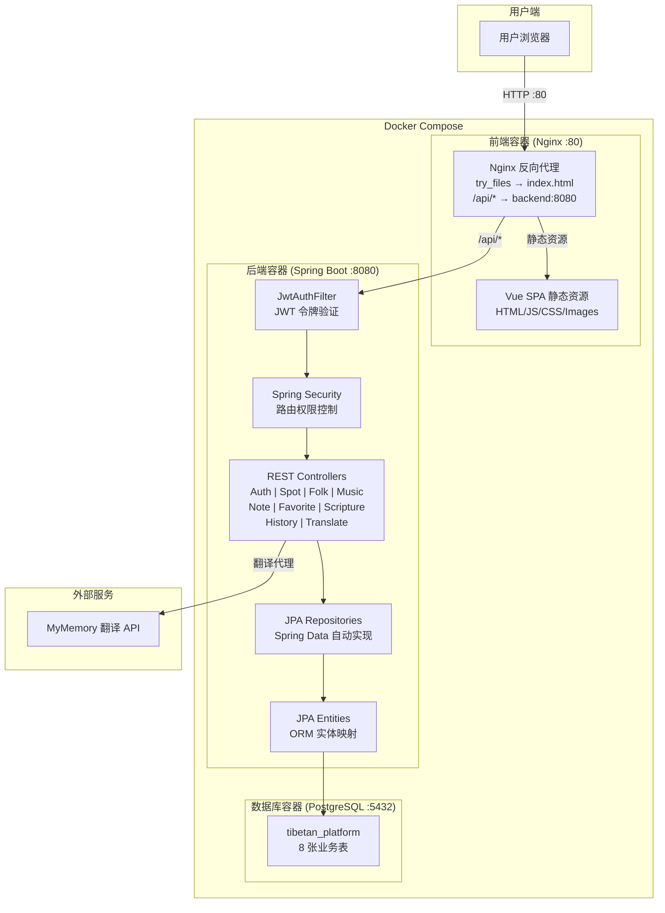
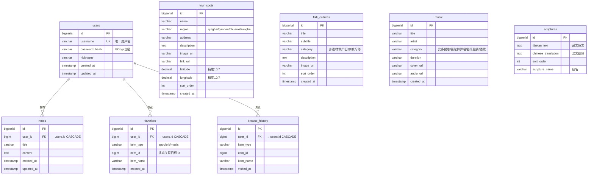
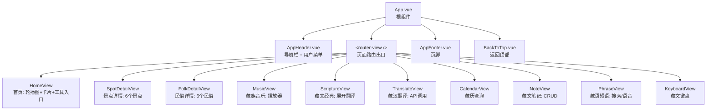
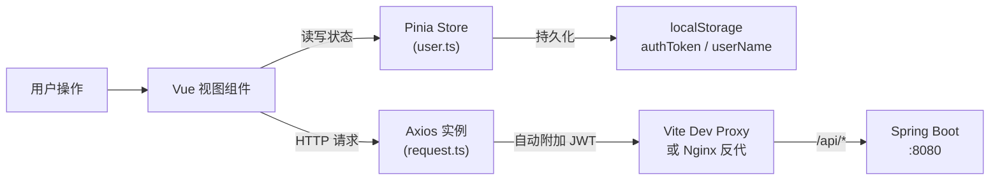
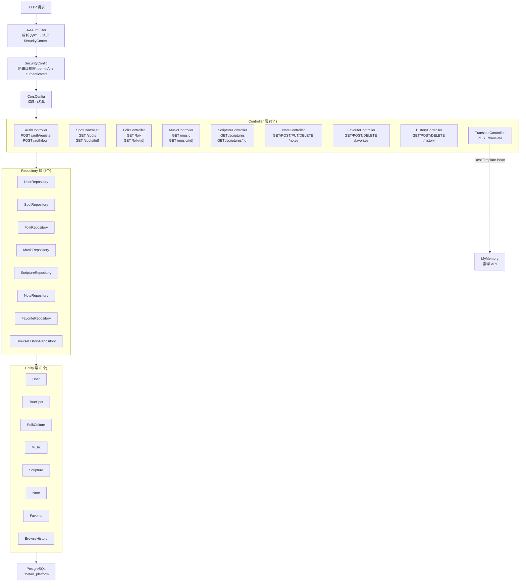
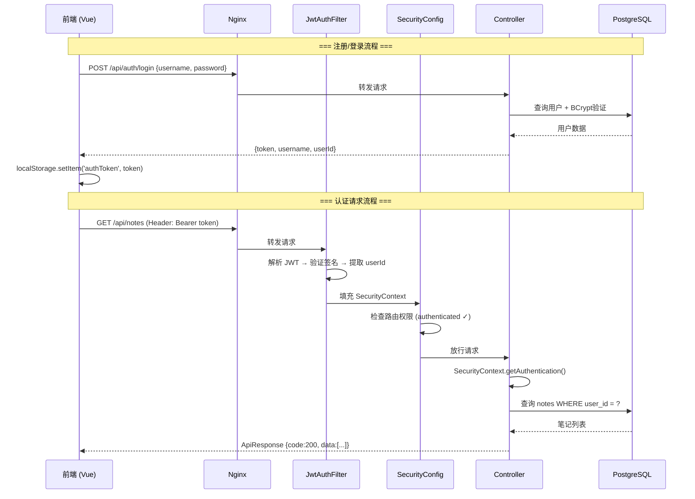
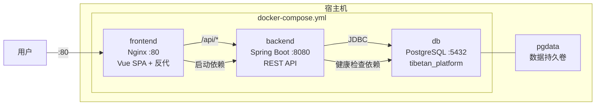
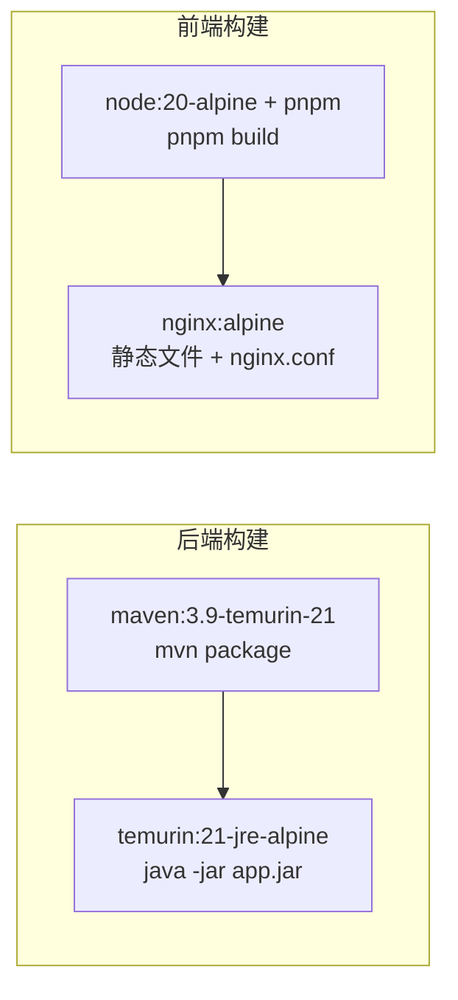
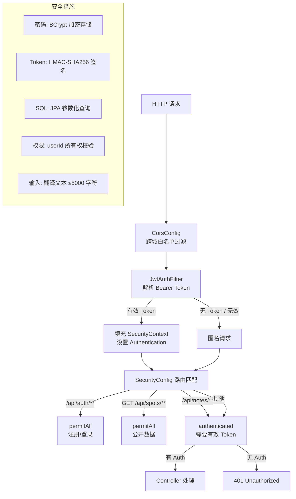

# 雪域安多·藏韵传承 — 代码架构文档

## 一、项目概述

本项目为安多藏族文化传播平台，采用前后端分离架构，前端使用 Vue 3 + Vite 构建 SPA 应用，后端使用 Spring Boot 3 提供 RESTful API，数据库采用 PostgreSQL 16，通过 Docker Compose 实现容器化部署。

---

## 二、系统总体架构图



---

## 三、E-R 图（实体关系图）



### 实体关系说明

| 关系 | 类型 | 说明 |
|------|------|------|
| users → notes | 1:N | 一个用户拥有多条笔记，删除用户级联删除笔记 |
| users → favorites | 1:N | 一个用户拥有多条收藏，(user_id, item_type, item_id) 唯一约束 |
| users → browse_history | 1:N | 一个用户拥有多条浏览记录 |
| favorites → tour_spots/folk_cultures/music | 多态 | item_type 区分收藏类型，item_id 指向对应表主键 |
| tour_spots | 独立 | 按 region 分组 |
| folk_cultures | 独立 | 按 category 分类 |
| music | 独立 | 按 category 分类 |
| scriptures | 独立 | 经文数据，按 sort_order 排序 |

---

## 四、前端架构

### 4.1 技术栈

| 技术 | 版本 | 用途 |
|------|------|------|
| Vue | 3.5 | 前端框架（Composition API + SFC） |
| Vite | 8.0 | 构建工具 |
| TypeScript | 6.0 | 类型安全 |
| Vue Router | 4.6 | SPA 路由 |
| Pinia | 3.0 | 状态管理 |
| Axios | 1.15 | HTTP 客户端 |
| SCSS | 1.99 | CSS 预处理器 |
| Font Awesome | 4.7 | 图标库（CDN） |

### 4.2 前端组件树



### 4.3 目录结构

```
frontend/
├── index.html                    # Vite 入口（含 CDN: Font Awesome + Google Fonts）
├── vite.config.ts                # Vite 配置（@ 别名, /api 代理）
├── tsconfig.app.json             # TypeScript 配置（@ 路径映射）
├── package.json                  # 依赖管理
├── Dockerfile                    # 生产构建（Node → Nginx）
├── nginx.conf                    # Nginx 配置（SPA history + API 反代）
├── public/
│   ├── images/                   # 静态图片资源
│   └── music/movies/             # 视频资源
└── src/
    ├── main.ts                   # 应用入口（createApp + Pinia + Router）
    ├── App.vue                   # 根组件（Header + router-view + Footer）
    ├── vite-env.d.ts             # Vite 客户端类型声明
    ├── router/index.ts           # 路由配置（10 条路由，懒加载）
    ├── stores/user.ts            # Pinia 用户状态（认证、登录、注销）
    ├── api/request.ts            # Axios 实例（JWT 拦截器、401 处理）
    ├── types/
    │   ├── spot.ts               # TourSpot 接口定义
    │   └── folk.ts               # FolkCulture 接口定义
    ├── components/
    │   ├── layout/
    │   │   ├── AppHeader.vue     # 统一导航栏（藏文 Logo + 导航 + 用户菜单）
    │   │   └── AppFooter.vue     # 统一页脚
    │   └── common/
    │       └── BackToTop.vue     # 返回顶部按钮
    ├── views/                    # 10 个页面视图（见组件树）
    └── assets/styles/
        ├── variables.scss        # CSS 变量（设计令牌）
        └── global.scss           # 全局重置样式
```

### 4.4 路由表

| 路由 | 视图组件 | 功能 | 是否需要认证 |
|------|----------|------|:---:|
| `/` | HomeView | 首页（轮播图+民俗卡片+旅游卡片+8个工具） | 否 |
| `/spots/:id` | SpotDetailView | 景点详情 | 否 |
| `/folk/:id` | FolkDetailView | 民俗详情 | 否 |
| `/music` | MusicView | 藏族音乐 | 否 |
| `/scripture` | ScriptureView | 藏文经典 | 否 |
| `/translate` | TranslateView | 藏汉翻译 | 否 |
| `/calendar` | CalendarView | 藏历查询 | 否 |
| `/notes` | NoteView | 藏文笔记 | 是 |
| `/phrases` | PhraseView | 藏语短语 | 否 |
| `/keyboard` | KeyboardView | 藏文键盘 | 否 |

### 4.5 前端数据流图



---

## 五、后端架构

### 5.1 技术栈

| 技术 | 版本 | 用途 |
|------|------|------|
| Spring Boot | 3.4.3 | 后端框架 |
| Spring Data JPA | - | ORM 数据访问 |
| Spring Security | - | 认证授权 |
| PostgreSQL | 16 | 关系数据库 |
| Flyway | - | 数据库版本迁移 |
| JJWT | 0.12.6 | JWT Token 生成与验证 |
| Lombok | - | 代码简化 |
| Maven | 3.9 | 构建工具 |

### 5.2 后端分层架构图



### 5.3 目录结构

```
backend/
├── pom.xml                                    # Maven 依赖配置
├── Dockerfile                                 # 多阶段构建（Maven → JRE Alpine）
└── src/main/
    ├── java/com/tibetan/platform/
    │   ├── TibetanPlatformApplication.java    # Spring Boot 启动类
    │   ├── config/
    │   │   ├── SecurityConfig.java            # Spring Security 配置
    │   │   ├── CorsConfig.java                # CORS 跨域配置
    │   │   ├── JwtUtil.java                   # JWT 工具类
    │   │   ├── JwtAuthFilter.java             # JWT 认证过滤器
    │   │   └── RestTemplateConfig.java        # RestTemplate Bean 配置
    │   ├── entity/                            # 8 个 JPA 实体类
    │   ├── repository/                        # 8 个数据访问接口
    │   ├── controller/                        # 9 个 REST 控制器
    │   └── dto/
    │       ├── ApiResponse.java               # 统一响应格式
    │       └── AuthRequest.java               # 认证请求 DTO
    └── resources/
        ├── application.yml                    # 应用配置
        └── db/migration/
            ├── V1__init_schema.sql            # 建表脚本（8张表+索引）
            └── V2__seed_data.sql              # 种子数据（12景点+6民俗+4音乐+27经文）
```

### 5.4 API 接口总览

#### 认证接口（无需 Token）

| 方法 | 路径 | 说明 | 请求体 | 响应 |
|------|------|------|--------|------|
| POST | `/api/auth/register` | 用户注册 | `{ username, password }` | `{ token, username, userId }` |
| POST | `/api/auth/login` | 用户登录 | `{ username, password }` | `{ token, username, userId }` |

#### 公开接口（无需 Token）

| 方法 | 路径 | 说明 |
|------|------|------|
| GET | `/api/spots` | 景点列表（可选 `?region=qinghai`） |
| GET | `/api/spots/{id}` | 景点详情 |
| GET | `/api/folk` | 民俗列表 |
| GET | `/api/folk/{id}` | 民俗详情 |
| GET | `/api/music` | 音乐列表（可选 `?category=安多民歌`） |
| GET | `/api/music/{id}` | 音乐详情 |
| GET | `/api/scriptures` | 经文列表（可选 `?name=二十一度母礼赞`） |
| GET | `/api/scriptures/{id}` | 经文详情 |
| POST | `/api/translate` | 翻译代理（`{ text, from, to }`） |

#### 需认证接口（Header: `Authorization: Bearer <token>`）

| 方法 | 路径 | 说明 |
|------|------|------|
| GET | `/api/notes` | 获取当前用户笔记列表 |
| POST | `/api/notes` | 创建笔记 |
| PUT | `/api/notes/{id}` | 更新笔记（校验所有权） |
| DELETE | `/api/notes/{id}` | 删除笔记（校验所有权） |
| GET | `/api/favorites` | 获取收藏列表 |
| POST | `/api/favorites` | 添加收藏 |
| DELETE | `/api/favorites?itemType=spot&itemId=1` | 取消收藏 |
| GET | `/api/history` | 获取浏览历史 |
| POST | `/api/history` | 记录浏览 |
| DELETE | `/api/history` | 清空浏览历史 |

#### 统一响应格式

```json
{
  "code": 200,
  "message": "success",
  "data": { ... }
}
```

### 5.5 JWT 认证时序图



---

## 六、数据库设计

### 6.1 表结构总览

| 表名 | 说明 | 种子数据 |
|------|------|:---:|
| users | 用户表 | - |
| tour_spots | 景点表 | 12 条 |
| folk_cultures | 民俗文化表 | 6 条 |
| music | 音乐表 | 4 条 |
| scriptures | 经文表 | 27 条 |
| notes | 用户笔记表 | - |
| favorites | 用户收藏表 | - |
| browse_history | 浏览历史表 | - |

### 6.2 索引设计

| 索引名 | 表 | 列 | 用途 |
|--------|-----|-----|------|
| idx_notes_user | notes | user_id | 按用户查询笔记 |
| idx_favorites_user | favorites | user_id | 按用户查询收藏 |
| idx_history_user | browse_history | user_id | 按用户查询历史 |
| idx_spots_region | tour_spots | region | 按区域筛选景点 |
| idx_music_category | music | category | 按分类筛选音乐 |
| UNIQUE | favorites | (user_id, item_type, item_id) | 防止重复收藏 |
| UNIQUE | users | username | 用户名唯一 |

### 6.3 Flyway 迁移文件

| 文件 | 内容 |
|------|------|
| `V1__init_schema.sql` | 8 张表 + 7 个索引 |
| `V2__seed_data.sql` | 12 景点 + 6 民俗 + 4 音乐 + 27 经文 |

---

## 七、Docker 容器化

### 7.1 部署拓扑图



### 7.2 构建流程图



### 7.3 启动命令

```bash
# 一键启动全部服务
docker-compose up -d --build

# 分别开发
cd frontend && pnpm dev          # 前端 http://localhost:5173
cd backend && mvn spring-boot:run # 后端 http://localhost:8080

# 仅启动数据库
docker-compose up -d db
```

---

## 八、安全架构图



| 安全措施 | 实现 |
|----------|------|
| 密码加密 | BCrypt（Spring Security） |
| 认证机制 | JWT Token（HMAC-SHA256，有效期 24 小时） |
| CSRF 防护 | 禁用（无状态 API，靠 JWT） |
| CORS 跨域 | 白名单模式（localhost:5173/3000） |
| SQL 注入 | JPA 参数化查询 |
| 权限控制 | 笔记/收藏/历史接口校验 userId 所有权 |
| 输入验证 | 翻译文本长度限制 5000 字符 |
| 错误脱敏 | 外部 API 错误不暴露给客户端 |
| 数据库迁移 | Flyway 版本控制 |

---

## 九、环境变量

| 变量 | 默认值 | 说明 |
|------|--------|------|
| `DB_USER` | tibetan | PostgreSQL 用户名 |
| `DB_PASSWORD` | tibetan123 | PostgreSQL 密码 |
| `DB_HOST` | localhost | 数据库主机（Docker 内为 `db`） |
| `DB_NAME` | tibetan_platform | 数据库名 |
| `JWT_SECRET` | xueyu-amdo-... | JWT 签名密钥（生产环境请更换） |

---

## 十、文件统计

| 模块 | 文件数 | 说明 |
|------|:---:|------|
| 前端视图 | 10 | Vue SFC 页面组件 |
| 前端组件 | 3 | 布局 + 通用组件 |
| 前端基建 | 8 | 路由/状态/API/类型/样式/类型声明 |
| 后端实体 | 8 | JPA Entity 类 |
| 后端接口 | 9 | REST Controller |
| 后端仓库 | 8 | JPA Repository |
| 后端配置 | 5 | Security/CORS/JWT/Filter/RestTemplate |
| 后端 DTO | 2 | 请求响应封装 |
| SQL 迁移 | 2 | Flyway V1 建表 + V2 种子数据 |
| Docker | 4 | Compose + 2 Dockerfile + Nginx |
| **合计** | **59** | |
